# Encryption Control Flow and Component Diagrams

These diagrams summarize the current Parquet PME prototype and the Lucene storage encryption
implementation used for comparison.

## Parquet PME: Engine Bootstrap and Writer Creation

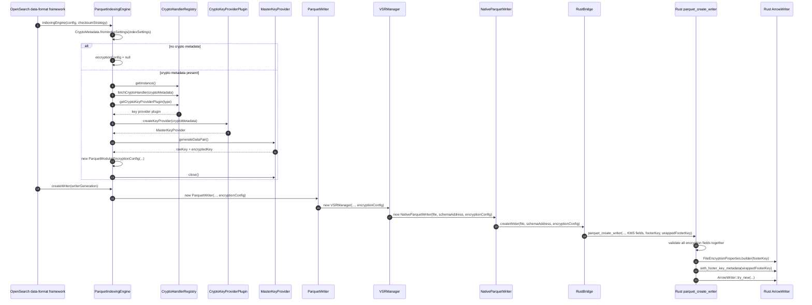

## Parquet PME: Write, Flush, Sync

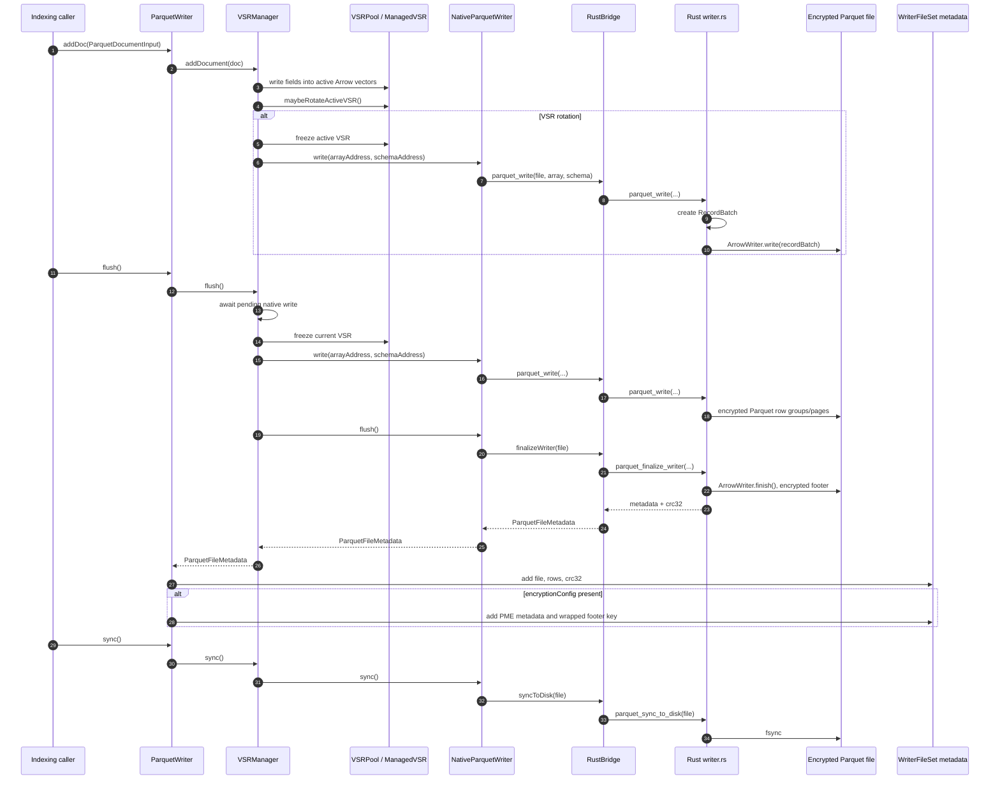

## Parquet PME: Current Prototype Decrypt Read

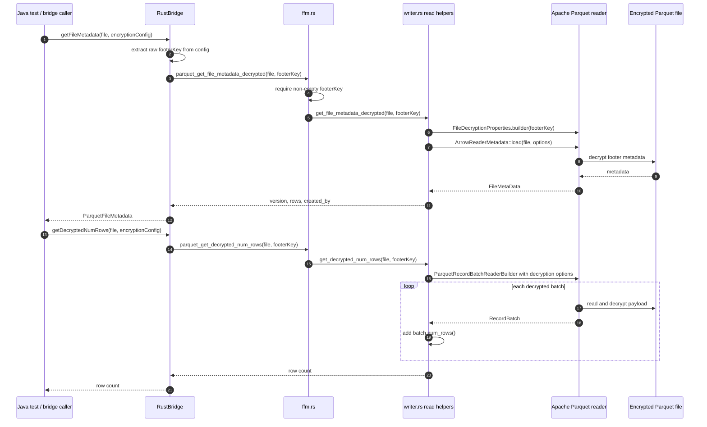

## Parquet PME: Missing Production Reader Rehydration

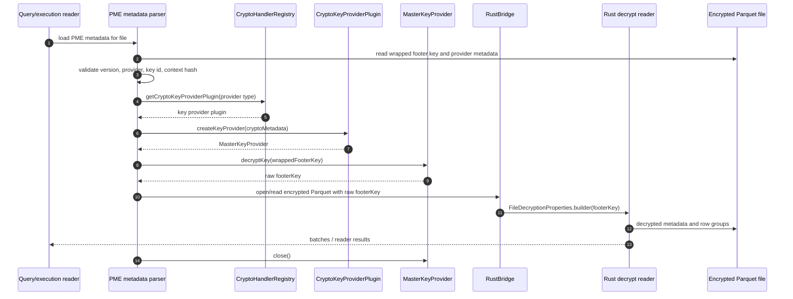

## Lucene Storage Encryption: Directory Creation and Key Setup

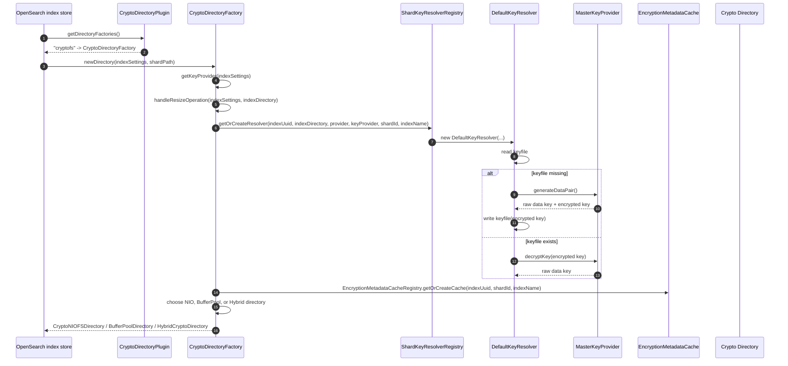

## Lucene Storage Encryption: NIO Write Path

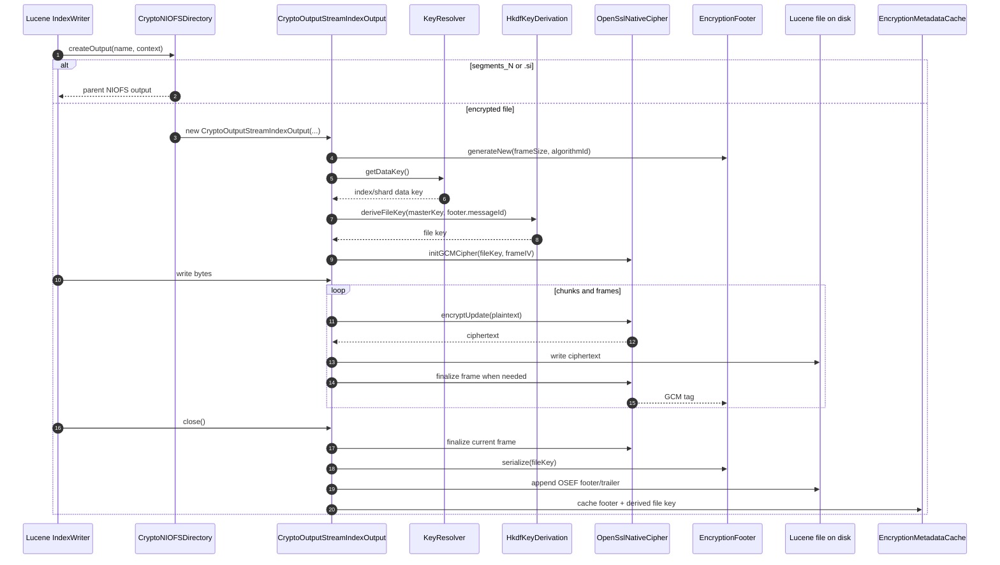

## Lucene Storage Encryption: NIO Read Path

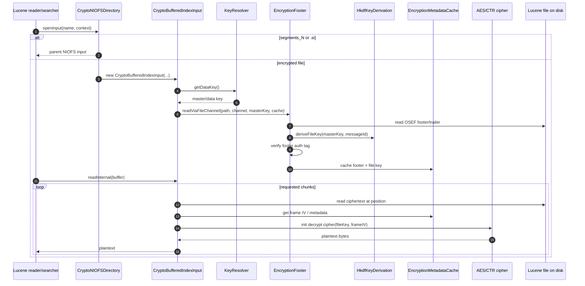

## Lucene Storage Encryption: BufferPool / Direct I/O Read Path

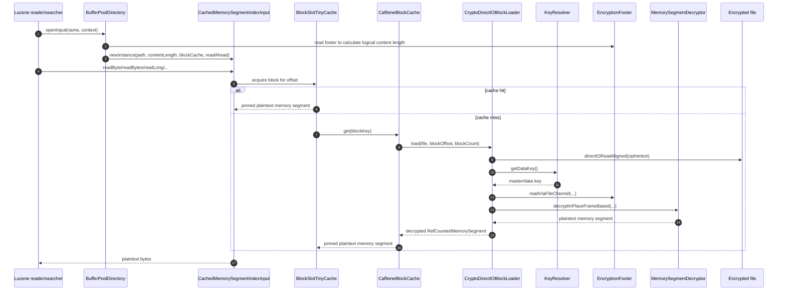

## Component Class Structure: Parquet PME

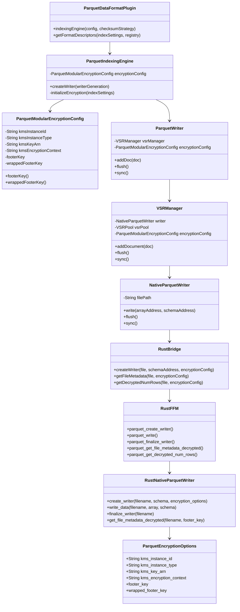

## Component Class Structure: Lucene Storage Encryption

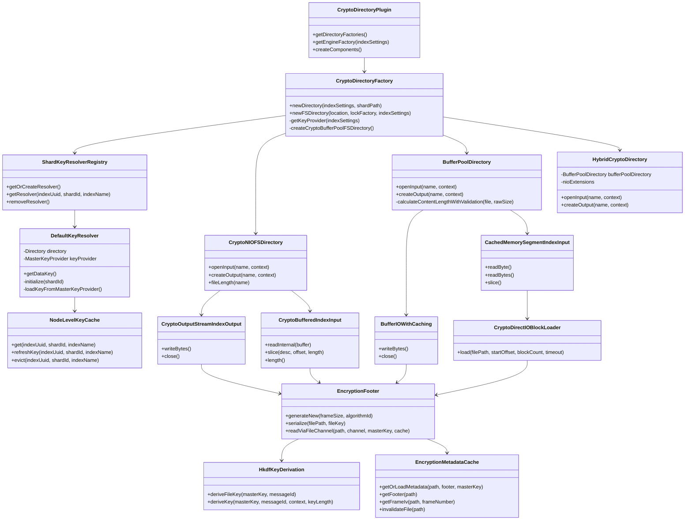

## Key Material Object Diagram

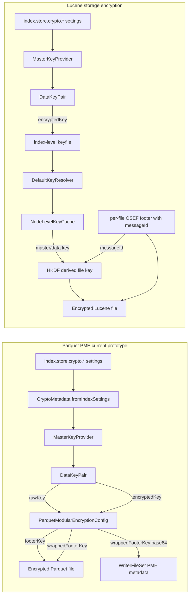
