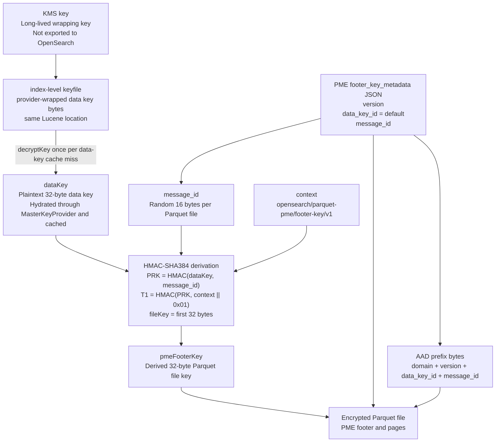
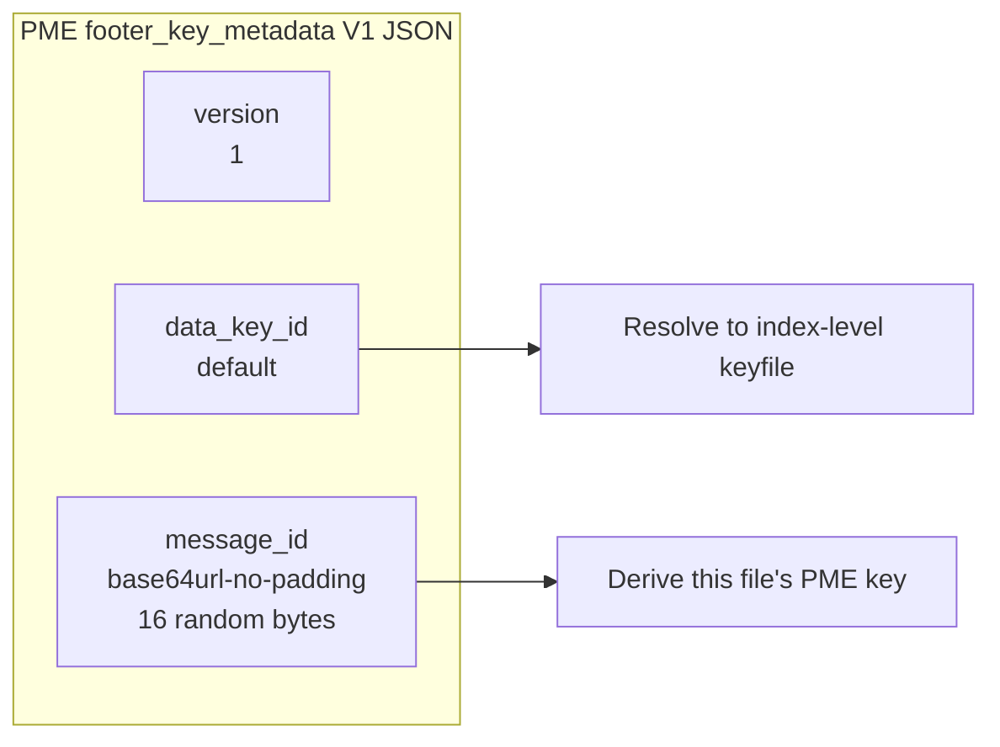
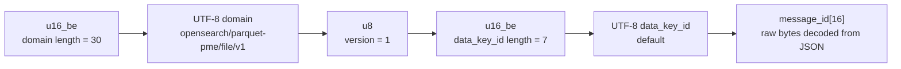
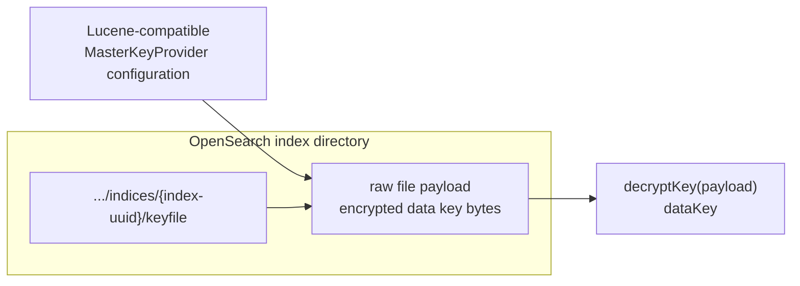
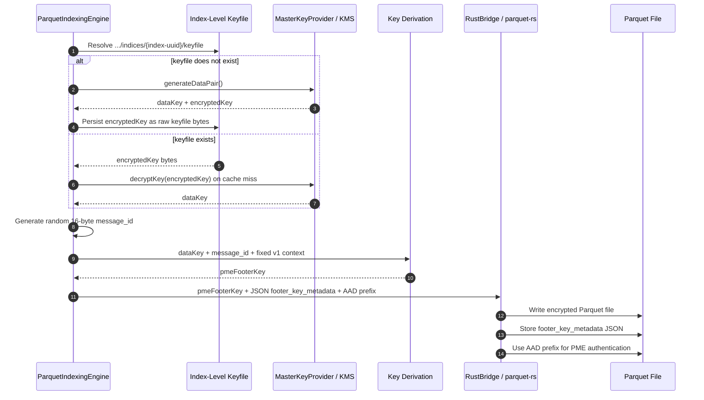
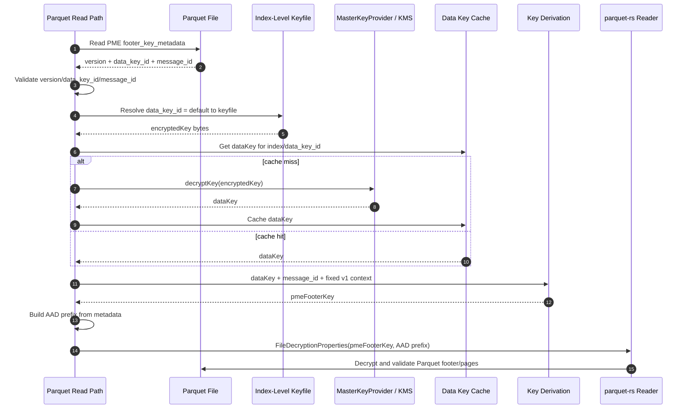
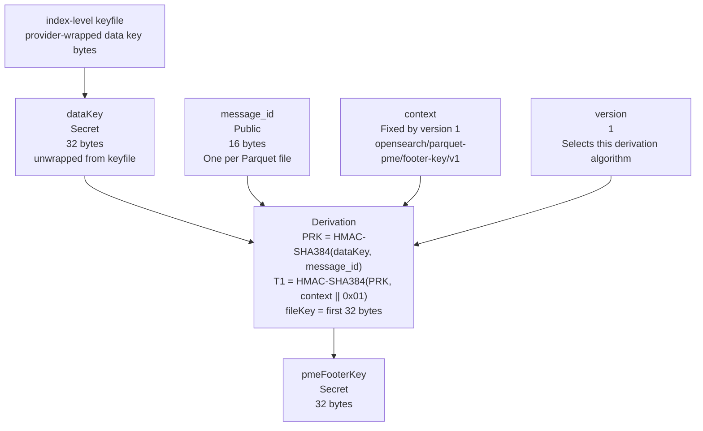
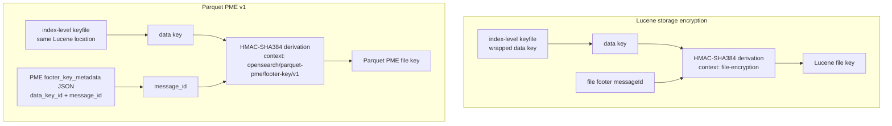
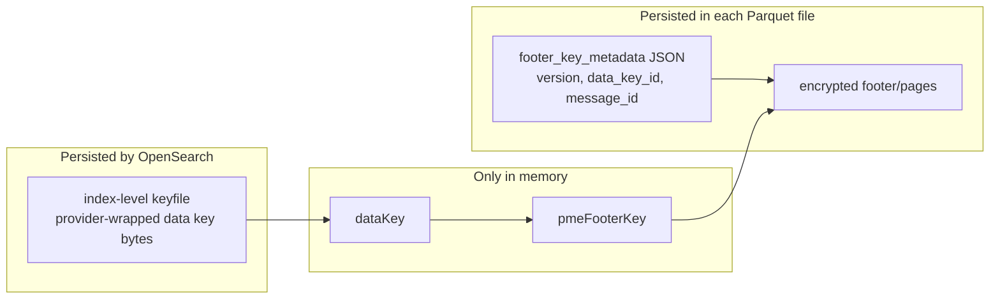

# PME Key Visualization

This document visualizes the simplified v1 Parquet PME key model.

The mental model is:

```text
Parquet file -> data_key_id + message_id
data_key_id = default -> index-level keyfile
MasterKeyProvider unwraps keyfile bytes once
data key + message_id -> derived Parquet file key
derived key decrypts the Parquet file
```

## Key Hierarchy



## Footer Key Metadata JSON



## AAD Prefix Bytes



## Index-Level Keyfile



## Write Flow



## Read Flow



## Derivation Inputs



## Lucene Comparison



## What Is Persisted


